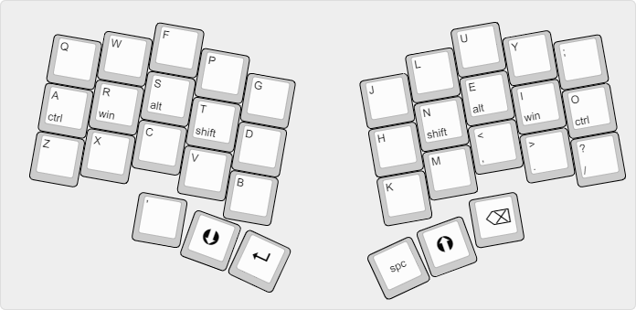

# bgkeeb keymap 
for bgkeeb by github.com/sadekbaroudi

My keymap version for bgkeeb. Different thumbkeys vs sadekbaroudi's implementation.

# bgkeeb_keymap
13 Feb 2022 - Edited Colemak layout

17 Feb 2022 - Created keymap layout 

18 Feb 2022 - Edited QWERTY keymap

image for easier reference
Access layout here: [BGKEEB](http://www.keyboard-layout-editor.com/#/gists/191f4f5232b2b0d154fcab026a305150)